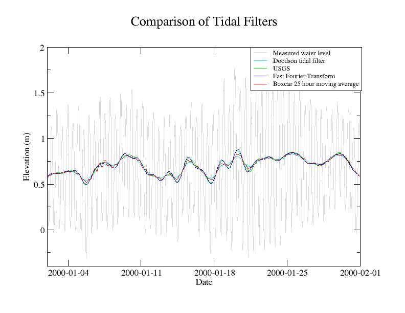
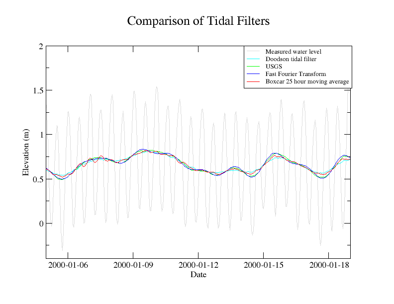
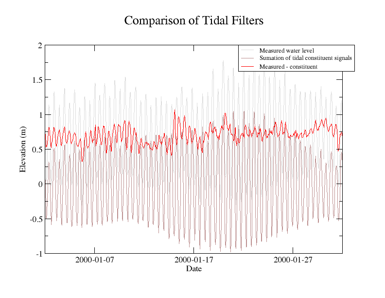

In general, the Fast Fourier Transform will create the best filtered
data set.

You can ask for all of the filters to be output at once with the
following command. Of course use your own data and definition file.

::

   tappy.py analysis --outputts --filter usgs,transform,doodson,boxcar mayport_florida_8720220_data.txt mayport_florida_8720220_data_def.txt

Then look for the files outts_filtered\_\ *.dat where the* is the name
of the filter.

USGS
----

The USGS transform is a straight convolution. It is also known as PL33,
since it has 33 values on either side of the the center value: 0.06215.

::

   [-0.00027 -0.00114 -0.00211 -0.00317 -0.00427 -0.00537 -0.00641 -0.00735
    -0.00811 -0.00864 -0.00887 -0.00872 -0.00816 -0.00714 -0.0056  -0.00355
    -0.00097  0.00213  0.00574  0.0098   0.01425  0.01902  0.024    0.02911
     0.03423  0.03923  0.04399  0.04842  0.05237  0.05576  0.0585   0.06051
     0.06174  0.06215  0.06174  0.06051  0.0585   0.05576  0.05237  0.04842
     0.04399  0.03923  0.03423  0.02911  0.024    0.01902  0.01425  0.0098
     0.00574  0.00213 -0.00097 -0.00355 -0.0056  -0.00714 -0.00816 -0.00872
    -0.00887 -0.00864 -0.00811 -0.00735 -0.00641 -0.00537 -0.00427 -0.00317
    -0.00211 -0.00114 -0.00027]

Doodson
-------

Doodson is also a convolution technique. The kernel is:

::

   [1, 0, 1, 0, 0, 1, 0, 1, 1, 0, 2, 0, 1, 1, 0, 2, 1, 1, 2, 0, 2, 1, 1, 2, 0, 1, 1, 0, 2, 0, 1, 1, 0, 1, 0, 0, 1, 0, 1]

Boxcar
------

Boxcar is a strait moving average of 25 hours. This in effect makes it
also a convolution technique with 25 values of 1/25.0.

Fast Fourier Transform
----------------------

The FFT filtering process was described in ‘Removing Tidal-Period
Variations from Time-Series Data Using Low Pass Filters’ by Roy Walters
and Cythia Heston, 1981, in Physical Oceanography, Volume 12, pg 112.
This article found that of the FFT transform, Godin, cosine-Lanczos
squared filter, and cosine-Lanczos filter the FFT transform method
performed the best.

After transform into the frequency domain zero out all frequencies lower
than 30, leave untouched frequencies higher than 40 and linear ramp
between 30 and 40. Transform the altered frequency domain series into
the time-domain.

You might be tempted to simply subtract the sum of all the constituent
signals from the original series. This doesn’t end up as nice as the
tidal filters above.

